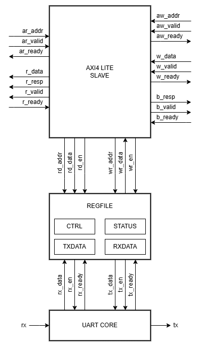
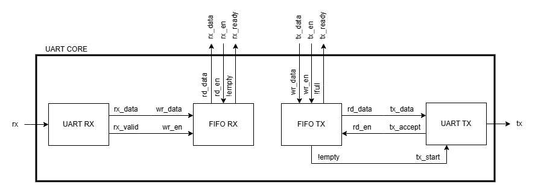

# RTL Architecture

This document describes the RTL architecture of the UART peripheral and how it integrates into a SoC-style system through an AXI4-Lite memory-mapped interface. The design is intentionally simple and is split into three blocks:

1. **AXI4-Lite Slave Adapter**  
   Terminates AXI-Lite protocol and converts bus transactions into a simple regfile-style interface.
2. **Register File**  
   Implements the memory-mapped registers and translates reads/writes into UART-side handshake pulses.
3. **UART Core**  
   Implements the actual RX/TX logic and uses FIFOs to decouple bus timing from the UART bitrate.

## 1. High-level System Overview

From a software point of view, the UART peripheral is exposed as a memory-mapped I/O region. The CPU (AXI Master) performs normal loads/stores to a base address + offset, and the AXI protocol interconnect those transfers to this design (AXI Slave). Internally, the register file controls an UART core that drives the external `rx` / `tx` pins.

### Top-level IP Block Diagram (AXI Slave + Regfile + UART Core)

- **AXI-Lite interface**
  - Write Address (AW): `aw_addr`, `aw_valid`, `aw_ready`
  - Write Data (W): `w_data`, `w_valid`, `w_ready`
  - Write Response (B): `b_resp`, `b_valid`, `b_ready`
  - Read Address (AR): `ar_addr`, `ar_valid`, `ar_ready`
  - Read Data/Response (R): `r_data`, `r_resp`, `r_valid`, `r_ready`

- **Regfile interface**
  - Write: `wr_addr`, `wr_data`, `wr_en` (pulse)
  - Read: `rd_addr`, `rd_data`, `rd_en` (pulse)

- **UART core handshake**
  - RX side:
    - `rx_data`
    - `rx_ready` = "RX FIFO has data"
    - `rx_en` (pulse) = "pop one RX byte"
  - TX side:
    - `tx_data`
    - `tx_ready` = "TX FIFO has space"
    - `tx_en` (pulse) = "push one TX byte"

## 2. RTL Files

- `rtl/axi/axi_lite_slave.vhd` : Minimal AXI4-Lite slave adapter.
- `rtl/regfile/uart_regfile.vhd` : Memory-mapped register bank.
- `rtl/uart/uart_core.vhd` : RX/TX + FIFOs integration.
- `rtl/uart/uart_rx.vhd` : UART receiver.
- `rtl/uart/uart_tx.vhd` : UART transmitter.
- `rtl/fifo/fifo_sync.vhd` : Synchronous FIFO used by the core.

Testbenches live in `tb/`.

## 3. UART Core Internals

The UART core contains dedicated RX/TX submodules and FIFO buffers.

### UART RX (`uart_rx.vhd`)
- Detects start bit.
- Samples incoming bits.
- Assembles a full byte.
- Emits `rx_valid` with `rx_data` to push into the RX FIFO.

### UART TX (`uart_tx.vhd`)
- Waits for a byte from the TX FIFO.
- Sends start bit, data bits, and stop bit.
- Provides a ready/accept interface to the TX FIFO/control logic.

### FIFOs (`fifo_sync.vhd`)
- **RX FIFO**:
  - Write side driven by UART RX (`wr_en`).
  - Read side driven by regfile (`rd_en` / `rx_en`).
- **TX FIFO**:
  - Write side driven by regfile (`tx_en`).
  - Read side driven by UART TX.

FIFO depth is parameterizable.

## 4. Register File (Register Map Summary)

The regfile exposes a small set of memory-mapped registers:

- `CTRL`   (`0x00`): enable/disable TX and RX features.
- `STATUS` (`0x04`): exposes `tx_ready` / `rx_ready` status bits.
- `TXDATA` (`0x08`): writing pushes bytes into the transmit path (if ready).
- `RXDATA` (`0x0C`): reading pops bytes from the receive path (if ready).

A detailed bit-level description is maintained in [`docs/02_register_map.md`](02_register_map.md).

## 5. AXI4-Lite Slave Adapter

The AXI-Lite slave is intentionally minimal:
- Supports single outstanding read and write responses.
- Always returns `OKAY` responses (`RRESP/BRESP = 00`).
- Converts AXI handshakes into simple one-cycle strobes for the regfile:
  - `wr_en` pulses once per accepted write transaction.
  - `rd_en` pulses once per accepted read transaction.

### Addressing and Alignment
The regfile uses a 32-bit style offset map (`0x00`, `0x04`, `0x08`, `0x0C`), even if the internal payload is only 8-bit data. This matches typical AXI-Lite peripheral conventions.

### Undefined Addresses
If software accesses an undefined register offset:
- Reads return zero.
- Writes are ignored.
- The AXI response remains `OKAY`.

## 6. Dataflows

### TX Path (CPU → UART TX pin)

1. **CPU write (MMIO)**: the driver writes a byte to `TXDATA` (`BASE + 0x08`).
2. **AXI-Lite Slave**:
   - Accepts the AXI write address/data handshakes.
   - Generates a one-cycle pulse `wr_en` with `wr_addr` and `wr_data`.
3. **Regfile**:
   - Decodes `wr_addr`.
   - When writing `TXDATA`, it attempts to push `wr_data` into the TX path by asserting `tx_en` (1-cycle pulse), only if TX is enabled and `tx_ready` indicates space/availability.
4. **UART Core**: Enqueues the byte into the TX FIFO.
5. **UART TX**: serializes the byte into start/data/stop bits and drives the `tx` output pin.

### RX Path (UART RX pin → CPU)

1. **UART RX**: receives serial data on the `rx` pin and reconstructs bytes.
2. **UART Core**: pushes received bytes into the RX FIFO and asserts `rx_ready` when data is available.
3. **CPU read (MMIO)**: the driver reads `RXDATA` (`BASE + 0x0C`).
4. **AXI-Lite Slave**:
   - Accepts the AXI read address handshake.
   - Pulses `rd_en` with `rd_addr`.
   - Returns `rd_data` on `r_data` with `r_valid`.
5. **Regfile**:
   - Decodes `rd_addr`.
   - When reading `RXDATA`, it exposes the next RX byte on `rd_data`.
   - It also asserts `rx_en` (1-cycle pulse) to pop the FIFO only if RX is enabled and `rx_ready` is high.

## 7. Clocking and Reset

- Single clock domain: all modules are synchronous to `clk`.
- Reset: `rst` resets the internal state (AXI response valids, regfile state, etc.).
- Handshake strobes (`wr_en`, `rd_en`, `tx_en`, `rx_en`) are **one-cycle pulses**.

## 8. Limitations and Future Work

Current design goals favor simplicity:
- No interrupts (polling via STATUS).
- `RRESP/BRESP` always `OKAY`.
- No support for multi-outstanding transactions.
- Optional future improvements:
  - Interrupt line(s) for RX available / TX space
  - stricter error signaling (SLVERR on invalid access)
  - WSTRB support and full 32-bit register fields
  - configurable parity / stop bits / baud generator integration
